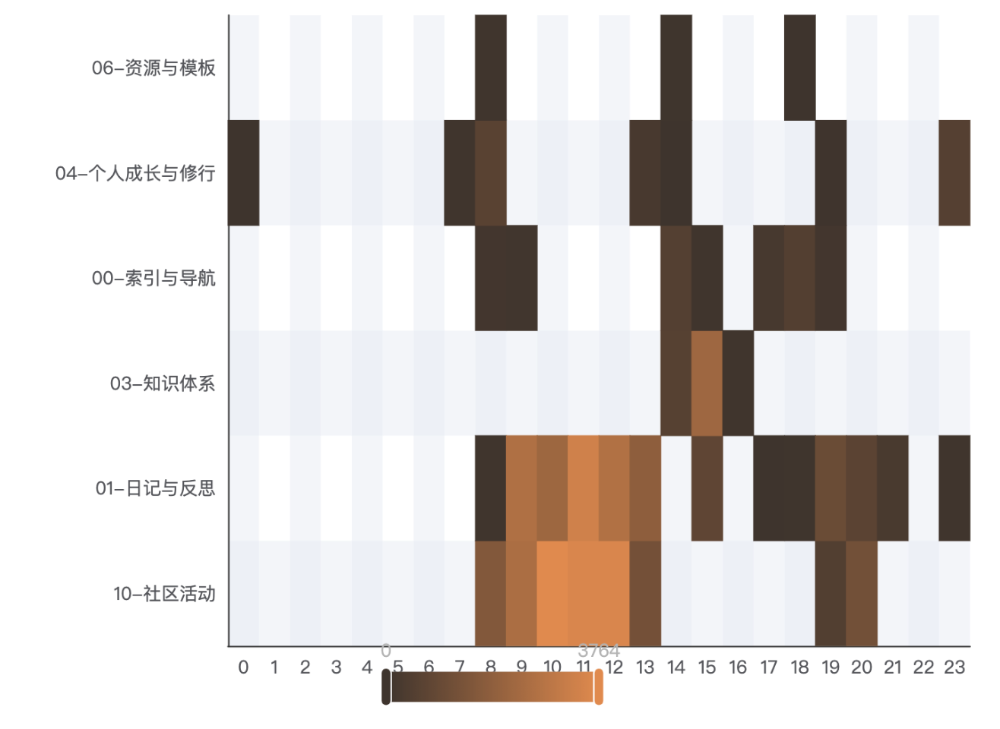
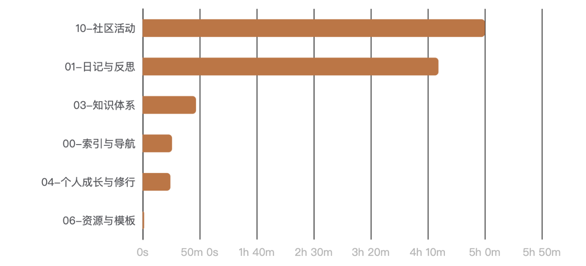
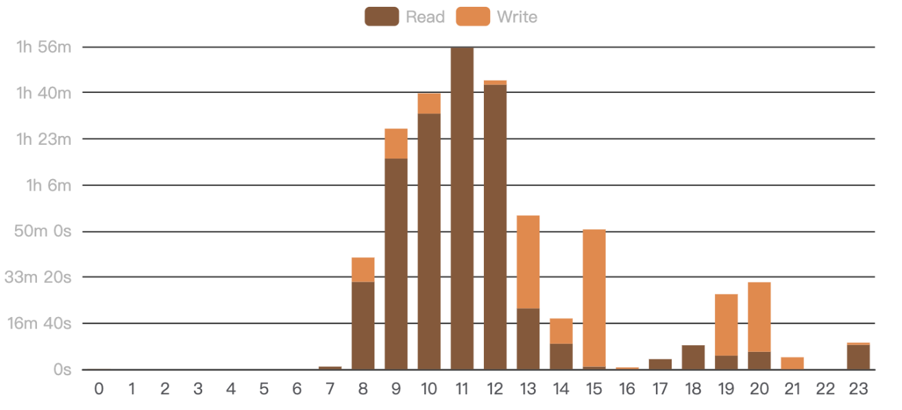
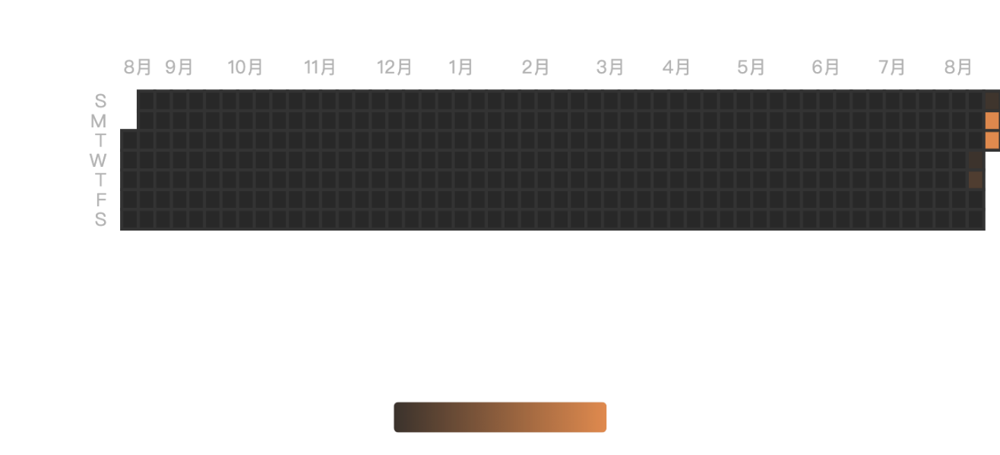
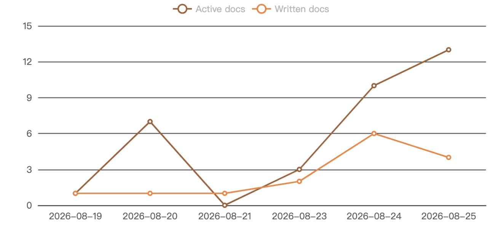
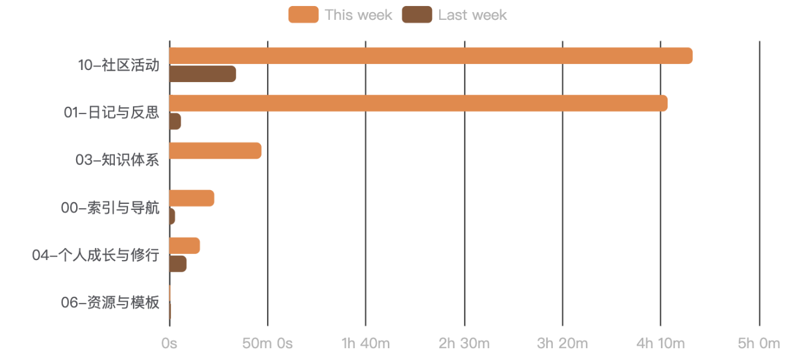
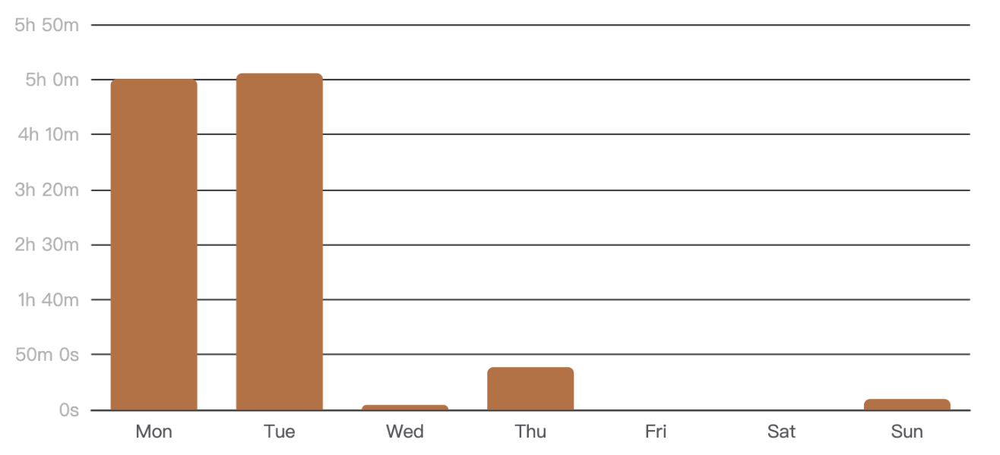
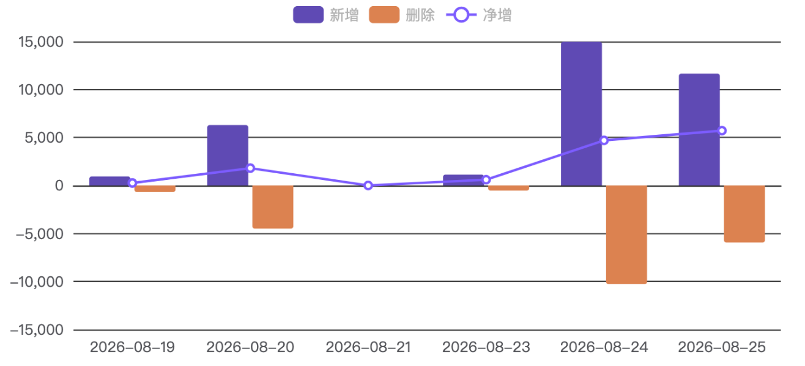
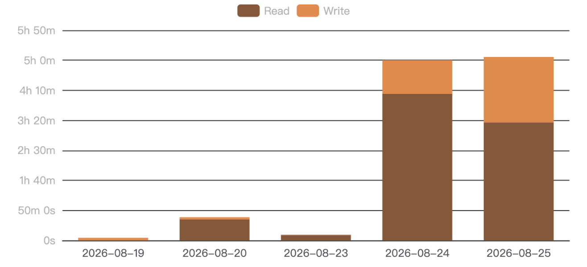
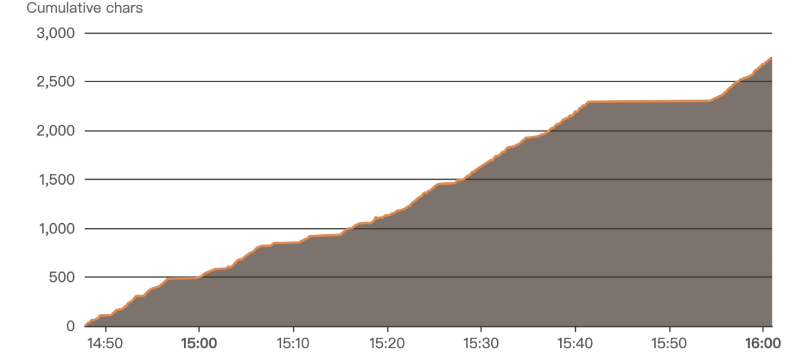

<div align="center">

# 🧭 MindTrace

**See where your attention actually goes.**

A silent, local-first **time & attention tracker** for Obsidian — a beautiful topic × time dashboard that reveals your focus, your writing output, and your habits.

[](https://github.com/CodyHp/mindtrace/releases)
[](LICENSE)

</div>

---

## ✨ The one chart that explains your day

MindTrace is a zero-friction **time tracker and attention analytics** plugin. It runs in the background and quietly records how long you spend on each note — reading and writing — then rolls everything up by **folder** and plots it as a **topic × time heatmap**. One glance, and you can see "mornings are for philosophy, afternoons for code."

<p align="center"></p>

## 🚀 Why MindTrace?

- **Zero friction** — no timers, no buttons, no popups. It just watches. Writing flow stays intact.
- **Folder = topic** — your vault is already organized; MindTrace treats your folder tree as the taxonomy and rolls time up recursively, drillable from topic → subfolder → file.
- **Read vs. write, inferred** — a transparent heuristic splits your active time into reading and writing, no manual tagging.
- **100% local** — everything lives in your vault. No account, no cloud, no telemetry, no note content is ever read.
- **Quantified self** — not a productivity nag, but a mirror: plain-language daily insights like "your most invested topic is philosophy" help you reflect, not judge.

## 📊 A dashboard full of insight

| | |
|:---:|:---:|
| **Topic × Time** — where your attention goes by hour | **Topic Ranking** — with click-to-drill-down |
|  |  |
| **Active Hours** — when you're actually working | **Activity Calendar** — GitHub-style daily streak |
|  |  |
| **Document Activity** — notes written vs. touched (day/week/month/quarter/year) | **This Week vs Last** — are you on an upswing? |
|  |  |
| **Weekday Distribution** — your weekly rhythm | **Word Trend** — writing output over time |
|  |  |
| **Read vs Write** — composition of your time | **Word Growth** — per-document writing trajectory |
|  |  |

Every chart exports to **PNG / JSON / CSV** with one click. The whole dashboard is theme-aware and follows your Obsidian accent color.

## 🔒 Privacy by design

Data is written as append-only JSONL to `.mindtrace/` in your vault. **No network, no telemetry, no cloud, no note content** — only metadata (paths, timestamps, durations, character deltas). Your notes never leave your computer.

## 📦 Install

From the Obsidian Community Plugins directory, search **MindTrace** and install. Or manually:

1. Download `main.js`, `manifest.json`, `styles.css` from the [latest release](https://github.com/CodyHp/mindtrace/releases).
2. Copy them into `<vault>/.obsidian/plugins/mindtrace/`.
3. Enable **MindTrace** in Settings → Community plugins.

## 🖱 Usage

1. Enable the plugin — tracking starts automatically, no setup needed.
2. Click the chart icon in the ribbon, or run **"Open dashboard"**, to open the dedicated dashboard note.
3. (Optional) embed the dashboard anywhere with a ` ```mindtrace ` code block.

Data is stored in `.mindtrace/events-YYYY-MM-DD.jsonl` (one file per day).

## 🛠 Development

```bash
npm install
npm run dev     # watch & build
npm run build   # type-check + production build
npm test        # unit tests
```

## 📄 License

[MIT](LICENSE)
